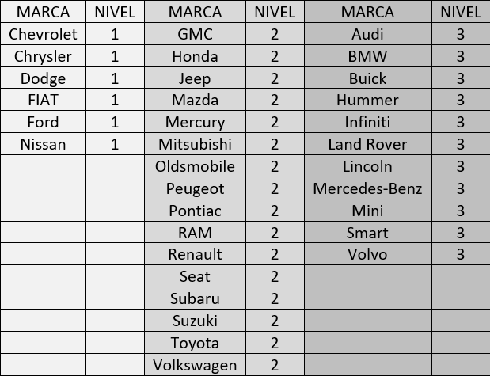

# Examen parcial 2022a

Ejercicio. Un banco nacional importante necesita de una aplicación Web que permita a clientes potenciales cotizar seguro de automóvil. Para la cotización es necesario recopilar información del vehículo, cliente y servicios a contratar. Dicha información se categoriza de la siguiente manera:

* Información del vehículo
  * Se solicita al usuario el año, marca y modelo del vehículo a asegurar
* Información del conductor
  * Sexo, fecha de nacimiento y Estado de la república de residencia
* Servicios
  1. Asistencia legal
  2. Robo: porcentaje deducible en caso de robo total
  3. Responsabilidad civil: importe límite en responsabilidad civil de bienes, importe límite en responsabilidad civil en personas y responsabilidad civil obligatoria en carreteras federales.
  4. Daños: porcentaje deducible en caso de daños materiales al auto
  5. Gastos médicos: importe límite en gastos médicos de los ocupantes
  6. Servicios adicionales: auxilio vial  (sí o no), auto sustituto (sí o no)

Para determinar el costo total del seguro considerar el siguiente procedimiento:

1. Base, depende del nivel del vehículo:
    1. Autos nivel 1: $7,000
    2. Autos nivel 2: $12,500
    3. Autos nivel 3: $25,000
2. Si el vehículo es Pickup, se agregan $2,000 a base
3. Si el conductor es hombre agregar un 4%, si es mujer 5%
4. Si la edad de la persona (considerar solamente el año de nacimiento):
    1. Menor a 25 años: agregar 12%
    2. Menor a 35 años: agregar 11%
    3. Mayores: agregar 10%
5. Si la persona vive en:
    1. CDMX, Nuevo León y Jalisco: agregar 12%
    2. Otro Estado: agregar 10%
6. Servicios:
    1. Asistencia legal: con aumenta 12%
    2. Deducible en caso de robo: del 5% al 15% aumenta 8% / 20% y 25% disminuye 10%
    3. Responsabilidad civil: del 500,000 al 1,500,000 aumenta 4% / 2,000,000 y 2,500,000 aumenta 7%
    4. Gastos médicos: del 500,000 al 1,500,000 aumenta 7% / 2,000,000 y 2,500,000 aumenta 8%
    5. Auxilio vial: con aumenta 7%
    6. Auto sustituto: con aumenta 10%
    7. Servicios adicionales: cada uno aumenta 3% (2 servicios = 6%, 3 = 9%, etc.)
7. Forma de pago
    1. Pago anual, no aumenta. 
    2. Semestral aumenta 3%. 
    3. Trimestral aumenta 5%. 
    4. Mensual aumenta 7%.

## Criterios:
1. La aplicación calcula correctamente (utiliza el archivo cotizador.xlsx) el costo anual del seguro de auto según el procedimiento antes descrito. (5 puntos)
2. La aplicación debe validar que el usuario ha establecido valor en todos los campos de las secciones “Datos del vehículo” y “Datos del conductor” antes de realizar una cotización. En caso de un dato faltante, informar con un mensaje de error (usa window.alert). (1 punto)
3. El dato "Edad del contratante" del “Resumen de tu seguro” se calcula correctamente considerando **mes** y **año** de la fecha seleccionada (asume que todos los años tienen la misma cantidad de días). (1 punto)
4. En la sección “Resumen de tu seguro” se muestran correctamente todas las opciones seleccionadas por el usuario en el formulario de la cotización de la siguiente manera (3 puntos):
   1. Si la cobertura agregada deberá aparecer la leyenda “Sí ampara”, en caso contrario “No ampara”.
   2. Las coberturas con importes de dinero y porcentajes se muestra la cantidad, en caso de no considerarlo deberá aparecer la leyenda “No agregado”.
   3. Los servicios adicionales agregados deberán aparecer en `.resumen-largo` separados por comas.
   4. La forma de pago deberá mostrarse en `.resumen-largo`.
	
## Tabla marcas

